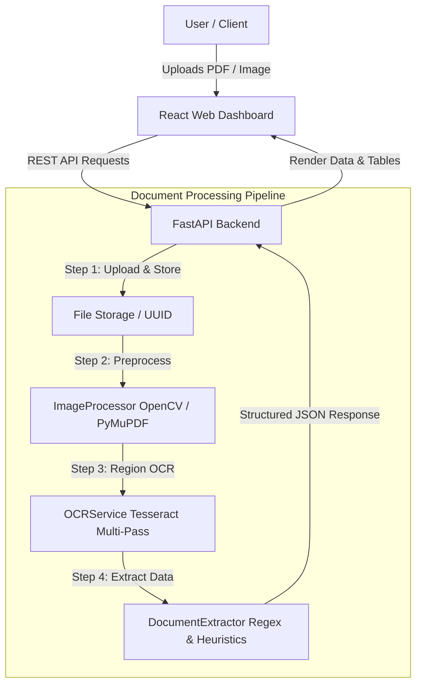

# DocuVoice 📄🔍

[](https://fastapi.tiangolo.com/)
[](https://react.dev/)
[](https://vitejs.dev/)
[](https://github.com/tesseract-ocr/tesseract)
[](https://opencv.org/)
[](LICENSE)

**DocuVoice** is an end-to-end Intelligent Document Processing (IDP) platform designed to convert unstructured documents (PDFs, invoices, receipts, resumes, and scans) into structured, actionable JSON data. It combines computer vision preprocessing, multi-pass region-aware OCR, and heuristic information extraction with an interactive web dashboard.

---

## 📑 Table of Contents

- [Key Features](#-key-features)
- [System Architecture](#-system-architecture)
- [Tech Stack](#-tech-stack)
- [Project Structure](#-project-structure)
- [Prerequisites](#-prerequisites)
- [Installation & Setup](#-installation--setup)
  - [1. Backend Setup](#1-backend-setup)
  - [2. Frontend Setup](#2-frontend-setup)
- [Running the Application](#-running-the-application)
- [API Reference](#-api-reference)
- [Example Extraction Output](#-example-extraction-output)
- [Roadmap](#-roadmap)
- [License](#-license)

---

## ✨ Key Features

- **Multi-Format Ingestion**: Supports PDF documents, PNG, JPG, and JPEG files with file type and size validation.
- **Computer Vision Preprocessing**: Automated image normalization, aspect-ratio-preserving scaling, grayscale optimization, and PyMuPDF-based multi-page PDF rasterization.
- **Region-Aware Multi-Pass OCR**:
  - Automatically segments and isolates tabular structures from surrounding text.
  - Multi-pass execution across Tesseract PSM modes (6 & 11) to maximize word-level and document-level confidence.
- **Structured Information Extraction**:
  - **Document Classification**: Automatic detection of Invoices, Receipts, Resumes, and Certificates.
  - **Field & Entity Recognition**: Extraction of dates, invoice numbers, currency amounts, vendor/customer info, contact details, etc.
  - **Table Parsing**: Reconstructs line items into structured arrays with quantities, unit prices, and totals.
- **Interactive UI Dashboard**: Modern React + Vite web application with drag-and-drop file upload, real-time stage-by-stage processing feedback, and structured JSON visualization.

---

## 🏗 System Architecture



---

## 🛠 Tech Stack

### Backend
- **Framework**: [FastAPI](https://fastapi.tiangolo.com/) + [Uvicorn](https://www.uvicorn.org/)
- **Image Processing**: [OpenCV (cv2)](https://opencv.org/), [Pillow (PIL)](https://python-pillow.org/)
- **PDF Engine**: [PyMuPDF (fitz)](https://pymupdf.readthedocs.io/)
- **OCR Engine**: [Pytesseract](https://github.com/madmaze/pytesseract) (Tesseract OCR wrapper)
- **Validation & Models**: [Pydantic v2](https://docs.pydantic.dev/)

### Frontend
- **Framework**: [React 19](https://react.dev/)
- **Build Tool**: [Vite](https://vitejs.dev/)
- **Styling**: Vanilla CSS (Custom Design System & Glassmorphism UI)

---

## 📁 Project Structure

```text
document_ai/
├── backend/
│   ├── app/
│   │   ├── api/
│   │   │   └── documents.py          # Document upload, preprocess, ocr & extract endpoints
│   │   ├── core/                     # Core configs & helpers
│   │   ├── models/                   # Data and persistence models
│   │   ├── schemas/                  # Pydantic schemas
│   │   ├── services/
│   │   │   ├── extraction/           # Document classification & information extraction
│   │   │   │   └── document_extractor.py
│   │   │   ├── ocr/                  # Region-aware OCR service
│   │   │   │   └── ocr_service.py
│   │   │   ├── preprocessing/        # PDF rasterization & image preprocessing
│   │   │   │   └── image_processor.py
│   │   │   └── validation/           # Business logic & field validations
│   │   └── main.py                   # FastAPI app entry point & CORS configuration
│   └── tests/                        # Automated backend tests
├── frontend/
│   ├── src/
│   │   ├── App.jsx                   # Main React dashboard interface
│   │   ├── index.css                 # Global styling and component themes
│   │   └── main.jsx                  # React application entry point
│   ├── package.json
│   └── vite.config.js
├── processed/                        # Processed grayscale/page image cache
├── uploads/                          # Stored source uploads
├── requirements.txt                  # Python dependencies
└── README.md
```

---

## 📦 Prerequisites

Before running the project, make sure you have:

1. **Python 3.10+** installed.
2. **Node.js 18+** and **npm** installed.
3. **Tesseract OCR** installed on your system:
   - **Windows**: Download the installer from [UB-Mannheim/tesseract](https://github.com/UB-Mannheim/tesseract/wiki) and add Tesseract to your system `PATH` (e.g. `C:\Program Files\Tesseract-OCR`).
   - **macOS**: `brew install tesseract`
   - **Linux (Ubuntu/Debian)**: `sudo apt-get install tesseract-ocr`

---

## 🚀 Installation & Setup

### 1. Backend Setup

1. Open your terminal in the root project directory:
   ```bash
   cd document_ai
   ```

2. Create and activate a Python virtual environment:
   - **Windows (PowerShell)**:
     ```powershell
     python -m venv .venv
     .venv\Scripts\Activate.ps1
     ```
   - **Linux / macOS**:
     ```bash
     python3 -m venv .venv
     source .venv/bin/activate
     ```

3. Install the required Python packages:
   ```bash
   pip install -r requirements.txt
   ```

### 2. Frontend Setup

1. Navigate to the `frontend` directory:
   ```bash
   cd frontend
   ```

2. Install the frontend dependencies:
   ```bash
   npm install
   ```

---

## 💻 Running the Application

### Option A: Using Docker & Docker Compose (Recommended 🚀)

Run both the FastAPI backend (with Tesseract OCR pre-configured) and React frontend in a single command:

```bash
docker-compose up --build
```

- **Frontend Dashboard**: [http://localhost](http://localhost)
- **Backend API**: [http://localhost:8000](http://localhost:8000)
- **Swagger API Docs**: [http://localhost:8000/docs](http://localhost:8000/docs)

---

### Option B: Local Manual Setup

#### 1. Start the Backend API

From the root directory (with your virtual environment activated):
```bash
uvicorn backend.app.main:app --reload --host 127.0.0.1 --port 8000
```
- API Docs (Swagger UI): [http://127.0.0.1:8000/docs](http://127.0.0.1:8000/docs)
- API Health Check: [http://127.0.0.1:8000/health](http://127.0.0.1:8000/health)

#### 2. Start the Frontend Client

In a separate terminal window, navigate to `frontend` and start the Vite dev server:
```bash
cd frontend
npm run dev
```
Open your browser and navigate to [http://localhost:5173](http://localhost:5173).


---

## 🔌 API Reference

| Method | Endpoint | Description |
| :--- | :--- | :--- |
| `GET` | `/health` | Service health status and API version |
| `POST` | `/documents/upload` | Upload document file (multipart/form-data) |
| `POST` | `/documents/{id}/preprocess` | Preprocess image variants or rasterize multi-page PDFs |
| `POST` | `/documents/{id}/ocr` | Run region-aware OCR extraction and return raw text + confidences |
| `POST` | `/documents/{id}/extract` | End-to-end extraction: document type, key-value fields, tables, and entities |

---

## 📊 Example Extraction Output

```json
{
  "document_id": "4b4ac88c-471e-49b3-be22-7c0ea5b6c74c",
  "status": "processed",
  "extraction": {
    "document_type": "invoice",
    "fields": {
      "invoice_number": "INV-10293",
      "invoice_date": "2026-08-18",
      "vendor": "ABC Electronics Pvt Ltd",
      "customer": "XYZ Industries",
      "subtotal": 110000.0,
      "tax": 19800.0,
      "total": 129800.0
    },
    "tables": [
      {
        "headers": ["Product", "Qty", "Price", "Total"],
        "rows": [
          ["Laptop", "2", "50,000", "100,000"],
          ["Mouse", "10", "1,000", "10,000"]
        ]
      }
    ],
    "ocr": {
      "average_confidence": 94.8,
      "word_count": 86
    }
  }
}
```

---

## 🗺 Roadmap

- [ ] **Transformer-based Layout Extraction**: Integrate LayoutLM / Donut models for zero-shot document parsing.
- [ ] **Database Persistence**: PostgreSQL integration for saving historical extraction runs and document metadata.
- [ ] **LLM Post-Processing**: Optional integration with OpenAI / Gemini API for complex reasoning on messy scans.
- [ ] **Containerization**: Docker and Docker Compose configuration for one-command deployment.

---

## 📄 License

This project is licensed under the terms of the [MIT License](LICENSE).
