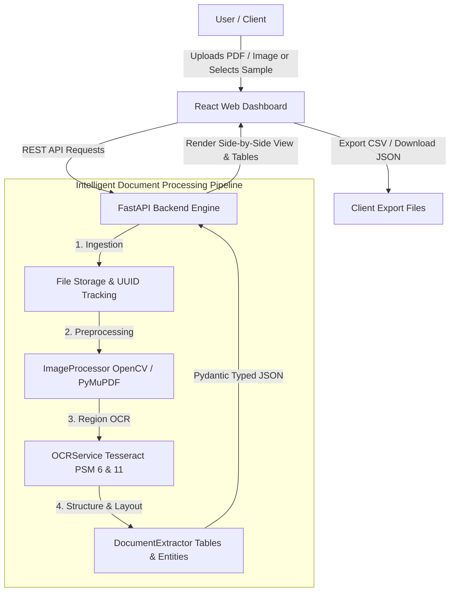

# DocuVoice 📄🔍

[](https://fastapi.tiangolo.com/)
[](https://react.dev/)
[](https://vitejs.dev/)
[](https://github.com/tesseract-ocr/tesseract)
[](https://opencv.org/)
[](https://www.docker.com/)
[](#-testing)
[](LICENSE)

**DocuVoice** is an enterprise-grade Intelligent Document Processing (IDP) platform designed to convert unstructured documents (PDFs, invoices, receipts, resumes, and scans) into structured, typed, actionable JSON data and exportable CSV tables.

It combines computer vision preprocessing, multi-pass region-aware OCR, heuristic classification, and an interactive split-screen web application with real-time visual inspection.

---

## 📑 Table of Contents

- [Key Features](#-key-features)
- [System Architecture](#-system-architecture)
- [Tech Stack](#-tech-stack)
- [Project Structure](#-project-structure)
- [Quick Start](#-quick-start)
  - [Option A: Docker Compose (Recommended)](#option-a-docker-compose-recommended)
  - [Option B: Local Development](#option-b-local-development)
- [API Reference](#-api-reference)
- [Testing](#-testing)
- [Export Capabilities](#-export-capabilities)
- [CI/CD Pipeline](#-cicd-pipeline)
- [License](#-license)

---

## ✨ Key Features

- **Split-Screen Visual Document Inspection**:
  - Live side-by-side view of the original document scan and the contrast-enhanced OpenCV preprocessed image.
  - Interactive zoom controls (50% to 250%) and 1:1 view toggle.
- **One-Click Instant Sample Library**:
  - Preloaded test documents (Tech Tax Invoice, Supermarket Receipt, Software Engineer Resume) for instant testing without uploading files.
- **Unified & Modular Pipeline Endpoints**:
  - Single-call pipeline (`POST /documents/process`) executing upload $\rightarrow$ preprocess $\rightarrow$ OCR $\rightarrow$ extraction with duration tracking.
  - Granular step endpoints for custom integrations (`/upload`, `/preprocess`, `/ocr`, `/extract`).
- **Computer Vision Preprocessing (OpenCV + PyMuPDF)**:
  - Aspect-ratio preserving resizing to optimal OCR resolution (1600px).
  - High-contrast grayscale conversion and automatic multi-page PDF rasterization at $2\times$ scale factor.
- **Region-Aware Multi-Pass OCR**:
  - Automatic isolation of tabular rows and bounding box mapping.
  - Multi-pass execution across Tesseract PSM modes (6 & 11) for maximal confidence scores.
- **Structured Schema Extraction**:
  - **Intent Classification**: Invoices, Receipts, Resumes, Certificates, Reports.
  - **Entity Recognition**: Regex extraction for emails, phone numbers, dates, and URLs.
  - **Dynamic Table Matrix Reconstruction**: Automatic row clustering and tabular JSON matrix generation.
- **Data Export**:
  - One-click **JSON Download** (typed Pydantic schema).
  - One-click **CSV Table Export** (for spreadsheet analysis).
  - One-click **Copy to Clipboard**.

---

## 🏗 System Architecture



---

## 🛠 Tech Stack

### Backend
- **Framework**: [FastAPI](https://fastapi.tiangolo.com/) + [Uvicorn](https://www.uvicorn.org/)
- **Validation & Schemas**: [Pydantic v2](https://docs.pydantic.dev/)
- **Computer Vision**: [OpenCV (cv2)](https://opencv.org/), [Pillow (PIL)](https://python-pillow.org/)
- **PDF Engine**: [PyMuPDF (fitz)](https://pymupdf.readthedocs.io/)
- **OCR Engine**: [Pytesseract](https://github.com/madmaze/pytesseract) (Tesseract OCR wrapper)
- **Testing**: [Pytest](https://pytest.org/), [HTTPX](https://www.python-httpx.org/)

### Frontend
- **Framework**: [React 19](https://react.dev/)
- **Tooling**: [Vite 8](https://vitejs.dev/) with development proxy
- **Styling**: Vanilla CSS Design System with responsive split-screen grid and glassmorphism accents

### DevOps & Containerization
- **Containers**: Multi-stage Dockerfiles for backend and frontend
- **Orchestration**: Docker Compose with Nginx reverse proxy
- **CI/CD**: GitHub Actions workflow running tests and build checks on pull requests

---

## 📁 Project Structure

```text
document_ai/
├── .github/
│   └── workflows/
│       └── ci.yml               # GitHub Actions CI workflow (pytest + vite build)
├── backend/
│   ├── app/
│   │   ├── api/
│   │   │   └── documents.py     # Pipeline, upload, ocr, extract, sample & preview endpoints
│   │   ├── core/
│   │   │   └── config.py        # Centralized settings & environment variables
│   │   ├── schemas/
│   │   │   └── document.py      # Typed Pydantic request and response models
│   │   ├── services/
│   │   │   ├── extraction/      # Document classification & information extraction
│   │   │   ├── ocr/             # Region-aware multi-pass OCR service
│   │   │   └── preprocessing/   # PDF rasterization & OpenCV image preprocessing
│   │   └── main.py              # FastAPI app entry point, OpenAPI metadata & CORS
│   ├── tests/
│   │   ├── conftest.py          # Pytest fixtures and test client setup
│   │   ├── test_api_endpoints.py# Integration tests for REST endpoints
│   │   ├── test_extractor.py    # Unit tests for heuristics, entities, and table parsing
│   │   └── test_image_processor.py # Unit tests for image preprocessing & resizing
│   ├── Dockerfile               # Production Dockerfile with Tesseract C++ engine
│   └── generate_samples.py      # Sample document generation script
├── frontend/
│   ├── src/
│   │   ├── components/
│   │   │   ├── Navbar.jsx       # Branding and status header
│   │   │   ├── Dropzone.jsx     # Drag-and-drop document upload area
│   │   │   ├── SamplePicker.jsx # One-click sample document cards
│   │   │   ├── PipelineStepper.jsx # Real-time animated pipeline stage indicator
│   │   │   ├── DocumentViewer.jsx  # Side-by-side zoomable document preview
│   │   │   ├── OverviewBadges.jsx  # KPI cards (Confidence, Type, Words, Latency)
│   │   │   ├── ExportBar.jsx    # CSV / JSON export actions
│   │   │   └── ResultTabs.jsx   # Multi-tab table, fields, entities, and raw JSON views
│   │   ├── App.jsx              # Main orchestrator component
│   │   └── index.css            # Production CSS design system
│   ├── nginx.conf               # Production Nginx reverse proxy config
│   ├── package.json
│   └── vite.config.js           # Vite config with backend API proxy
├── samples/                     # Preloaded sample demo documents (Invoice, Receipt, Resume)
├── docker-compose.yml           # Multi-container orchestration
├── requirements.txt             # Python backend dependencies
└── README.md
```

---

## ⚡ Quick Start

### Option A: Docker Compose (Recommended)

Requires [Docker Desktop](https://www.docker.com/products/docker-desktop/).

```bash
# Build and start all services
docker compose up --build
```

- Access Web Dashboard: **http://localhost**
- Interactive Swagger API Docs: **http://localhost/docs**
- Backend Health Check: **http://localhost/health**

---

### Option B: Local Development

#### 1. Backend Setup

```bash
# Create and activate virtual environment
python -m venv .venv
source .venv/bin/activate  # On Windows: .venv\Scripts\activate

# Install dependencies
pip install -r requirements.txt

# Start backend server
uvicorn backend.app.main:app --reload --port 8000
```

Backend will be available at `http://127.0.0.1:8000`.

#### 2. Frontend Setup

```bash
cd frontend
npm install
npm run dev
```

Frontend will be available at `http://localhost:5173`. The Vite development server automatically proxies API requests to `http://127.0.0.1:8000`.

---

## 📡 API Reference

Interactive OpenAPI documentation is available at `/docs` or `/redoc`.

| Method | Endpoint | Description |
|---|---|---|
| `GET` | `/health` | System health check and API version status |
| `GET` | `/documents/samples` | List preloaded sample documents for instant testing |
| `POST` | `/documents/samples/{id}/process` | Execute full pipeline on a selected sample document |
| `POST` | `/documents/process` | **Full Pipeline**: Upload and process document in one call |
| `POST` | `/documents/upload` | Upload document file and receive tracking UUID |
| `POST` | `/documents/{id}/preprocess` | Run OpenCV normalization and PDF rasterization |
| `POST` | `/documents/{id}/ocr` | Run multi-pass Tesseract OCR |
| `POST` | `/documents/{id}/extract` | Run classification, entities, and table matrix parser |
| `GET` | `/documents/{id}/file` | Stream uploaded source file (PDF or image) |
| `GET` | `/documents/{id}/preview` | Stream preprocessed high-contrast PNG preview |

---

## 🧪 Testing

The repository includes a comprehensive automated test suite covering unit heuristics, preprocessing resizing, and integration REST endpoints:

```bash
pytest backend/tests -v
```

All 16 test cases execute with zero external network dependencies in sub-second time.

---

## 📄 License

This project is licensed under the MIT License - see the [LICENSE](LICENSE) file for details.
